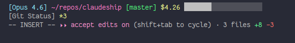

# claudeship

A custom statusline for [Claude Code](https://claude.ai/code).

Displays model name, working directory, git branch, session cost, context window usage bar, and git status.



# Install

# Binaries

Check [Releases](https://github.com/kloki/claudeship/releases) for binaries and installers

```sh
cargo install claudeship
```

# Configure

Add to `~/.claude/settings.json`:

```json
{
  "statusLine": {
    "type": "command",
    "command": "claudeship"
  }
}
```
